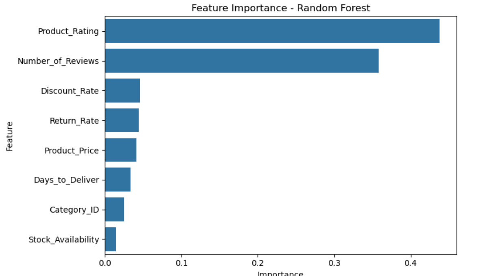

🛒 E-Commerce Product Performance Analysis
This project uses a synthetic yet realistic E-Commerce Product Performance Dataset to develop a model that predicts whether a product is likely to perform well in an online retail environment.

📊 Dataset Overview
The dataset contains 2,000 records with the following features:

Column Name	Description
Product_Price	The listed price of the product in USD (range: $5 - $1000)
Discount_Rate	Discount rate applied (0.0 to 0.8)
Product_Rating	Customer rating (1 to 5)
Number_of_Reviews	Total number of user reviews (0 to 5000, highly skewed)
Stock_Availability	1 if available in stock, 0 otherwise
Days_to_Deliver	Number of days it takes to deliver (1 to 30)
Return_Rate	Proportion of items returned (0.0 to 0.9)
Category_ID	ID of the product category (1 to 10)

Note: Each column has ~5% missing values to simulate real-world inconsistencies.

🎯 Project Goal
The objective is to predict a Product Performance Score and classify whether the product has Good Performance (1) or Not (0).

This label is derived from metrics like:

Number of reviews

Customer rating

Return rate

Delivery speed

🔍 Tasks & Workflow
Data Preprocessing

Filled missing values

Scaled numeric features

Removed outliers (if applicable)

Exploratory Data Analysis (EDA)

Plotted feature distributions and correlations

Investigated relationships between predictors and performance

Model Development

Train/test split with stratification

Used GridSearchCV to optimize a RandomForestClassifier

Evaluated accuracy, F1-score, precision, recall

Model Interpretation

Visualized feature importances

Used correlation plot for insight on predictive power

📈 Results
✅ Model Evaluation (Random Forest)
Accuracy: 92.75%

Confusion Matrix:

lua
Copy
Edit
[[305  15]
 [ 14  66]]
Classification Report:

Class	Precision	Recall	F1-score	Support
0 (Not Good)	0.96	0.95	0.95	320
1 (Good)	0.81	0.82	0.82	80

Weighted Avg F1-score: 0.93

🔬 Feature Importance
Top features impacting prediction:

Product_Rating

Number_of_Reviews

Return_Rate

Discount_Rate

These were visualized using a barplot of RandomForestClassifier.feature_importances_.

📊 Correlation Plot
This plot shows the relationship between each feature and the product performance score.

## 📌 Correlation Plot

🛠️ Tools & Technologies
Python (3.10+)

Pandas, NumPy

Scikit-learn

Matplotlib, Seaborn

